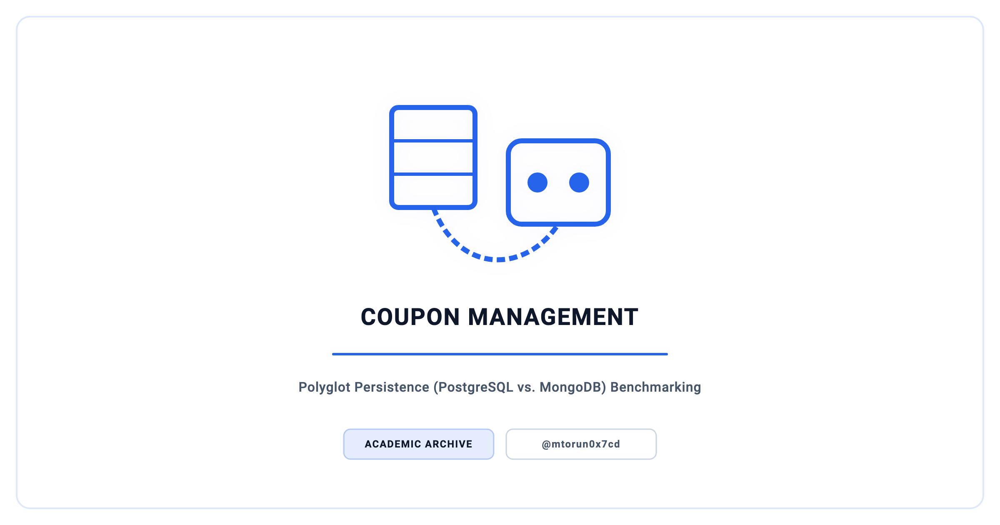
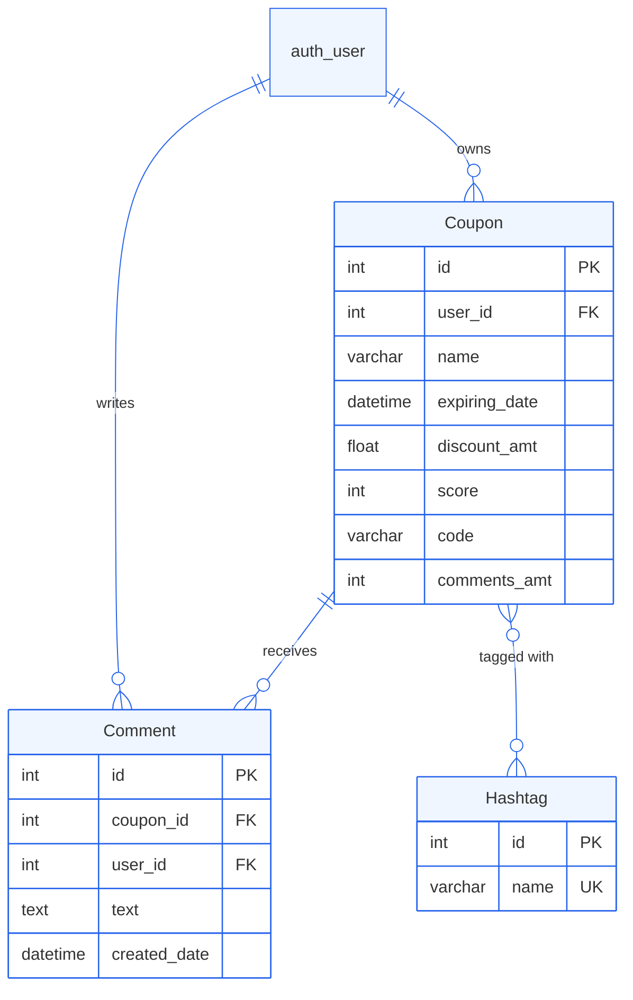
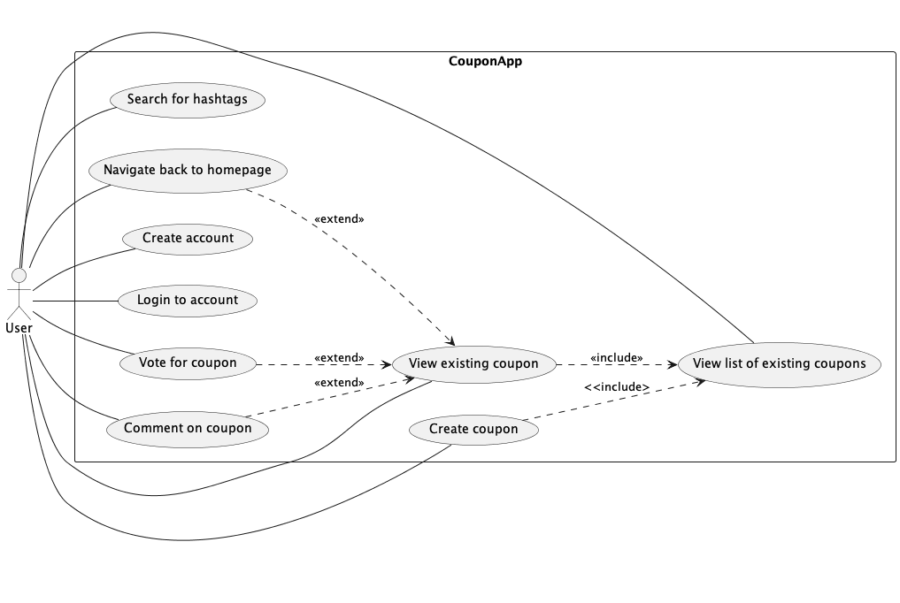

<p align="center">
  <picture>
    <source media="(prefers-color-scheme: dark)" srcset="docs/social_preview_dark.png" />
    <source media="(prefers-color-scheme: light)" srcset="docs/social_preview_light.png" />
    
  </picture>
</p>

# Coupon Management Platform

> A Django web application implemented against two database backends — PostgreSQL and MongoDB — for community-driven coupon sharing, built to compare relational and document storage under identical workloads using Locust load tests.

[](https://github.com/mtorun0x7cd/coupon-management/actions/workflows/ci.yml)


> **Archived.** A frozen record of completed work, preserved for reference and not actively maintained. See [`SECURITY.md`](SECURITY.md) for scope and disclosures.

---

## Overview

This platform lets users create, share, and discover discount coupons within a community. Registered users post coupons with discount metadata, upvote or downvote submissions, comment on deals, and find coupons through a hashtag-based taxonomy and search.

The technical focus is a **polyglot-persistence architecture**: the same Django application is run against two distinct database backends — PostgreSQL (relational, via `psycopg2`) and MongoDB (document-oriented, via Djongo). Both deployments share the same domain model, view, form, and URL layer, differing in the `settings.py` database configuration. This isolates storage-engine behaviour from application logic and makes the two engines directly comparable under identical workloads.

Load is generated with **Locust**, and seed scripts populate each backend with configurable volumes of test data, so the comparison runs against reproducible datasets. This is an archived academic team deliverable, retained for reference; it is not maintained and is not suitable for production use (see [Security](#security)).

## Context

| Dimension | Detail |
| :--- | :--- |
| **Institution** | TH Köln (Cologne University of Applied Sciences) |
| **Program** | Computer Science & Engineering (Technische Informatik) |
| **Course** | Large and Cloud-based Software Systems (LCSS) |
| **Semester** | Summer 2023 |
| **Type** | Team |

## Features

- **User management** — registration, authentication, password change, and a per-user coupon history via Django's built-in auth system
- **Coupon creation** — coupons with name, discount amount, expiration date, and an auto-generated coupon code derived from the name and discount
- **Voting** — upvote/downvote with an aggregate score tracked per coupon
- **Comments** — user comments on individual coupons, with a recomputed comment count
- **Hashtag taxonomy** — tag coupons with hashtags (auto-prefixed with `#`), then browse and search by hashtag through a global search form
- **Admin console** — Django admin registration for the `Coupon`, `Comment`, and `Hashtag` models
- **Dual database backends** — identical application logic running on PostgreSQL and on MongoDB via Djongo
- **Performance benchmarking** — Locust scenarios for HTTP-level and direct-query comparison of the two backends
- **Database seeding** — scripts that populate either backend with a configurable number of users and coupons

## Architecture

The project ships two parallel Django deployments under `src/`, each targeting a different storage engine:

```text
src/
├── postgresql/lcss/     # Django project backed by PostgreSQL (psycopg2)
│   ├── coupon/          # App: models, views, forms, templates
│   └── lcss/            # Project settings, URLs, WSGI/ASGI
└── mongodb/lcss/        # Django project backed by MongoDB (Djongo)
    ├── coupon/          # App: identical model/view layer
    └── lcss/            # Project settings (Djongo engine)
```

The model, view, form, and URL layers are identical across the two variants; they differ only in the `settings.py` database engine. This isolates storage-engine performance from application logic.

```text
┌─────────────┐     ┌──────────────┐     ┌─────────────────┐
│   Browser   │────▶│  Django App  │────▶│  PostgreSQL     │
│   (Client)  │     │  (Views,     │     │  OR             │
│             │◀────│   Forms,     │◀────│  MongoDB (Atlas)│
└─────────────┘     │   Templates) │     └─────────────────┘
                    └──────────────┘
                           ▲
                           │
                    ┌──────────────┐
                    │  Locust      │
                    │  (Load Test) │
                    └──────────────┘
```

The domain model consists of three entities:

- **Coupon** — linked to `auth.User` via `ForeignKey`; stores name, expiration, discount amount, score, code, comment count, and a many-to-many relation to Hashtag
- **Comment** — linked to both Coupon and User; stores text and an auto-timestamped creation date
- **Hashtag** — unique name field, auto-prepended with a `#` prefix on save

### Data Model

Both backends use the same Django model layer, shown below. On PostgreSQL it maps to normalized tables with a `coupon_coupon_hashtags` junction table; on MongoDB, Djongo (`ENFORCE_SCHEMA = True`) maps the same models onto collections with reference fields and a junction collection. The two deployments therefore exercise the same logical schema on different storage engines — the variable under study.



### Performance Benchmarking

Two Locust scenarios under `tests/` drive load against the system:

- [`locustfile.py`](tests/locustfile.py) — an `HttpUser` that repeatedly requests the hashtag search endpoint (`/search_coupons/`) on a running Django server, measuring end-to-end HTTP throughput and latency.
- [`locust_postgres_performance.py`](tests/locust_postgres_performance.py) — a scenario that opens a direct `psycopg2` connection per task and issues `SELECT * FROM coupon_coupon`, isolating database round-trip cost from the Django request stack.

The seed scripts under `scripts/` populate each backend with a configurable number of users and coupons (100 users by default), so both engines are exercised against comparable data volumes. Measured results depend on host hardware and database tuning and are not reproduced here; [`docs/BENCHMARK.md`](docs/BENCHMARK.md) gives the reproducible protocol and a results template to record them.



## Tech Stack

| Category | Technologies |
| --- | --- |
| Language | Python 3 |
| Framework | Django 4.2.1 |
| SQL database | PostgreSQL (via `psycopg2`) |
| NoSQL database | MongoDB Atlas (via Djongo) |
| Load testing | Locust |
| Diagrams | PlantUML |

## Project Structure

```text
coupon-management/
├── src/
│   ├── postgresql/lcss/               # Django project — PostgreSQL backend
│   │   ├── coupon/                    # App (models, views, forms, templates)
│   │   └── lcss/                      # Settings, URLs, WSGI/ASGI
│   └── mongodb/lcss/                  # Django project — MongoDB backend (Djongo)
│       ├── coupon/                    # App (identical logic)
│       └── lcss/                      # Settings (Djongo engine)
├── tests/
│   ├── locustfile.py                  # HTTP load test (hashtag search endpoint)
│   └── locust_postgres_performance.py # Direct PostgreSQL query load test
├── scripts/                           # Database seeding and cleanup utilities
├── assets/                            # PlantUML use-case diagram (source + PNG)
├── docs/
│   ├── social_preview.svg             # Repository header graphic (source)
│   ├── social_preview_light.png       # Header graphic — light theme
│   ├── social_preview_dark.png        # Header graphic — dark theme
│   ├── social_card.png                # Social sharing card
│   ├── render.sh                      # SVG-to-PNG rendering script
│   └── BENCHMARK.md                   # Benchmark protocol and results template
├── requirements.txt                   # Python dependencies
├── CITATION.cff
├── SECURITY.md
├── LICENSE
└── README.md
```

## Getting Started

### Prerequisites

- Python 3.10+
- PostgreSQL 14+ (for the SQL variant)
- MongoDB 6+ or a MongoDB Atlas account (for the NoSQL variant)

### Installation

```bash
# Clone the repository
git clone https://github.com/mtorun0x7cd/coupon-management.git
cd coupon-management

# Create and activate a virtual environment
python3 -m venv venv
source venv/bin/activate

# Install dependencies
pip install -r requirements.txt

# For the PostgreSQL backend:
pip install psycopg2-binary

# For the MongoDB backend:
pip install djongo pymongo
```

### Configuration

Set database credentials in the appropriate `settings.py`:

- **PostgreSQL**: `src/postgresql/lcss/lcss/settings.py`
- **MongoDB**: `src/mongodb/lcss/lcss/settings.py`

Provide a `DJANGO_SECRET_KEY` environment variable, or replace the placeholder in `settings.py`. The committed credentials are placeholders, not live secrets.

### Run (PostgreSQL variant)

```bash
cd src/postgresql/lcss
python manage.py migrate
python manage.py createsuperuser
python manage.py runserver
```

### Run (MongoDB variant)

```bash
cd src/mongodb/lcss
python manage.py migrate
python manage.py createsuperuser
python manage.py runserver
```

### Database Seeding

Seed scripts under `scripts/` populate test data for benchmarking:

```bash
# PostgreSQL seeding
python scripts/postgres_create_users.py
python scripts/postgres_create_coupons_for_users.py

# MongoDB seeding
python scripts/mongo_create_users.py
python scripts/mongo_create_coupons.py
python scripts/mongo_create_coupons_for_users.py
```

### Load Testing

```bash
# HTTP-level load test against the running Django server
locust -f tests/locustfile.py --host=http://localhost:8000

# Direct PostgreSQL query load test (bypasses Django)
locust -f tests/locust_postgres_performance.py
```

## Documentation

| Document | Description |
| :--- | :--- |
| [BENCHMARK.md](docs/BENCHMARK.md) | Reproducible PostgreSQL-vs-MongoDB benchmark protocol and results template |

## References

[1] Django Software Foundation, "Django Documentation (v4.2)," 2023. [Online]. Available: <https://docs.djangoproject.com/en/4.2/>

[2] M. Fowler, "Polyglot Persistence," *martinfowler.com*, 2011. [Online]. Available: <https://martinfowler.com/bliki/PolyglotPersistence.html>

[3] Locust Contributors, "Locust — A Modern Load Testing Framework." [Online]. Available: <https://locust.io/>

[4] The PostgreSQL Global Development Group, "PostgreSQL Documentation." [Online]. Available: <https://www.postgresql.org/docs/>

[5] MongoDB, Inc., "MongoDB Documentation." [Online]. Available: <https://www.mongodb.com/docs/>

[6] Doableware, "Djongo — Django and MongoDB Connector." [Online]. Available: <https://www.djongomapper.com/>

## Citation

Citation metadata is provided in [`CITATION.cff`](CITATION.cff); GitHub renders a *Cite this repository* action from it.

## Security

This is an archived academic project and is not actively maintained. It runs with Django's development settings — `DEBUG = True`, an empty `ALLOWED_HOSTS`, and a placeholder `SECRET_KEY` — and the database credentials in both `settings.py` files are placeholders, not live secrets. It has not undergone a security review and must not be deployed on an untrusted network or against real data. See [`SECURITY.md`](SECURITY.md) for details.

## License

This project is licensed under the MIT License — see the [LICENSE](LICENSE) file for details.

## Author

**Mert Torun, M.Sc.** — IT Security Architect · Systems Engineer  
mtorun0x7cd · Research & Development

His work spans the verification and validation of safety-critical systems, infrastructure hardening, and cryptographic integrity, grounded in an M.Sc. in Computer Science & Engineering from TH Köln. This repository is preserved as a record of a completed project rather than maintained as a living tool.

- **Email**: [info@mtorun0x7cd.com](mailto:info@mtorun0x7cd.com)
- **Website**: [mtorun0x7cd.com](https://mtorun0x7cd.com)
- **LinkedIn**: [linkedin.com/in/mtorun0x7cd](https://www.linkedin.com/in/mtorun0x7cd)
- **GitHub**: [github.com/mtorun0x7cd](https://github.com/mtorun0x7cd)
